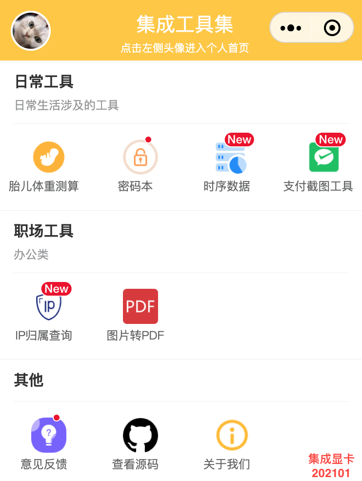

# 小程序工具集
> 基于微信小程序的各种简单工具合集

## 工具目录

**日常生活类**

  [胎儿体重测算](pages/daily/fetusWeight)
| [个人密码本](pages/daily/password)

**其他**

  [意见反馈](pages/issue)
| [关于](pages/about)

## 在线体验
> 左侧为小程序二维码

    
    

## 系列博文

1. [微信小程序开发基础（胎儿体重测算工具实例）](https://blog.csdn.net/ssrc0604hx/article/details/110877828)
2. [云函数开发及调试（意见反馈实例）](https://blog.csdn.net/ssrc0604hx/article/details/111587855)

## 首页预览

